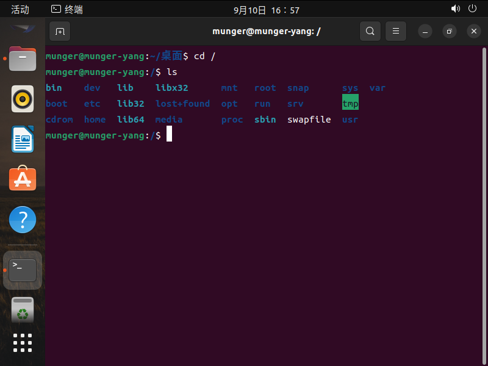
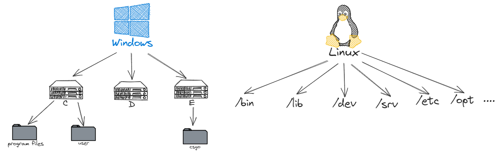
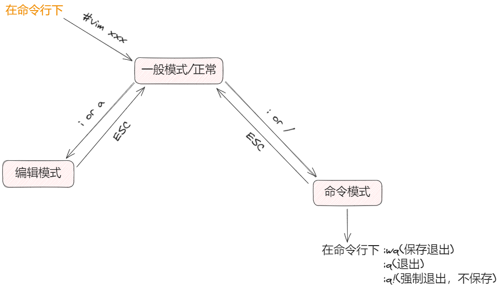
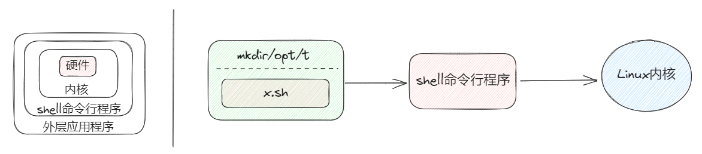

# Linux学习手册

<center>Author:杨桂淼&copy;

> 学会适应没有图形界面的操作，在Linux的世界中，一切皆是目录

## 文件管理命令

### 文件系统

- /bin是binary的缩写，存放常用的指令
- /sbin s就是super user的意思，这里存放着系统管理员使用的系统管理程序
- /root 该目录为系统管理员，也称作超级权限者的用户主目录
- /home 存放普通用户的主目录，在Linux中的每一个用户都有自己一个目录，一般目录名为用户的账号名
- /lib 系统开机时所用的基本动态链接库，作用类似于Windows中的DLL文件，几乎所有的应用程序都需要用到这个库。
- /lost+found 这个目录一般是空的，当系统非法关机后，这里存放着一些文件
- /etc[**常用**] 所有系统管理所需要的配置文件和子目录,比如安装MySQL数据库的配置文件-mysql.conf
- /usr[**常用**] 非常重要的目录，用户下载的很多应用程序都存放在这个目录当中，类似于Windows中的program files
- /boot[**常用**] 存放的是启动Linux时使用的一些核心文件，包括一些连接文件和镜像文件
- /proc[**不能动**] 虚拟目录，存放系统映射，访问这个目录用来获取系统信息
- /srv service的缩写，存放一些服务器启动后的提取的数据
- /sys 这是Linux2.6内核中一个很大的变化，该目录下安装了2.6版本之下新出现的一个文件系统sysfs
- /tmp 存放临时文件
- /dev 类似于Windows中的设备管理器，把所有的硬件用文件形式存储
- /media[**常用**] Linux系统自动识别一些设备，例如U盘、光驱，Linux会把外部设备挂载到这个目录上
- /mnt[**常用**] 系统提供目录是为了让用户临时挂载别的文件系统的，可以把外部的存储挂载到/mnt/上，然后进入该目录查看里面的内容。
- /opt 这是给主机安装额外安装软件的目录，如安装ORACLE数据库、JDK、MySQL就需要放到这个目录之下，默认为空。
- /usr/local[**常用**] 给另外一个主机额外安装软件所安装的目录，一般通过编译源码方式安装程序
- /var[**常用**] 这个目录中存放着不断扩充到东西
- /selinux 安全子系统，控制程序只能访问特定文件



两种经典操作系统的文档对比：



绝对路径： /home/acs/main.cpp

相对路径：tmp/main.cpp

特殊形式：ls.. 返回上层目录 		ls. 当前目录	ls ~/表示切换到家目录

区分路径的开头，**家目录**(/home/mungeryang)与**根目录**(/root)也要区分好！

### 文件管理常用指令

- `Ctral+C`：关闭正在运行的一个进程，**跳过**某一指令不执行。
- `Ctral+U`：**清空**本行指令
- `Tab`：自动**补全**本行指令；只有一种选项返回一个对象，如果有多个选项会返回多个文件供选择。
- `↑`：向上回退代码。
- `ls`：展示当前文件夹下的全部问价列表：蓝色是文件夹、白色是普通文件、绿色是可执行文件

`ls`常用的参数：

1. `ls -l`：输出文件的详细信息
2. `ls -lh`:格式化输出信息(例如将字节信息转化为KB)
3. `ls -a`:显示所有被隐藏的文件(在Linux系统下，所有以.为前缀的文件全部被隐藏)

- `pwd`：显示当前路径
- `cd`：切换进入文件目录，后面可以加任何路径(相对路径与绝对路径)，无论在哪个目录之下，只有输入cd指令立即返回家目录。 `cd..`返回上一层目录，`cd -`返回之前的目录。
- `cp`：复制+粘贴+重命名。cp a/tmp.txt b,将a文件夹下的tmp.txt文件复制到b文件夹中。cp a/tmp.txt **b/tmp2.txt**，将a文件夹下的tmp.txt文件复制到b文件夹中并兼具重命名的功能。cp a b -r，将a文件夹整体复制到b文件夹下。
- `mkdir`：创建文件夹，支持正则表达式：*代表默认匹配所有文件。`mkdir a/b/c -p`中`-p`参数表示如果有这个文件则跳过，如果没有这个文件夹则创建。
- `rm`：删除文件，支持正则表达式。如果文件夹中存放着`tmp1.txt`与`tmp2.txt`，可以使用指令`rm *.txt`将文件夹中的所有文件进行删除。`rm c -r`删除一个文件夹，`rm a/*`删除a中的文件而保留了a文件夹。**删除后找不回来。**
- `touch`:创建一个文件。
- `mv`:剪切+粘贴+重命名。
- `cat`:捕获该文件并查看文件中的内容。

## tmux与Vim

Vim是一种强大的文本编辑器，通常在终端中使用。它有很多功能和快捷键，适用于多种任务，包括代码编辑、文本处理等。

### tmux的使用

#### 功能

1. 分屏
2. 允许断开Terminal连接后，继续运行进程

#### 结构

一个tmux可以包含多个session，一个session可以包含多个window，一个window可以包含多个pane。
        实例：
            tmux:
                session 0:
                    window 0:
                        pane 0
                        pane 1
                        pane 2
                        ...
                    window 1
                    window 2
                    ...
                session 1
                session 2
                ...

#### 操作

(1) tmux：新建一个session，其中包含一个window，window中包含一个pane，**pane里打开了一个shell对话框**。
        (2) 按下`Ctrl + a`后手指松开，然后按`%`：将当前pane左右平分成两个pane。
        (3) 按下`Ctrl + a`后手指松开，然后按`"`：将当前pane上下平分成两个pane。
        (4) Ctrl + d：关闭当前pane；如果当前window的所有pane均已关闭，则自动关闭window；如果当前session的所有window均已关闭，则自动关闭session。
        (5) 鼠标点击可以选pane。
        (6) 按下`ctrl + a`后手指松开，然后按`方向键`：选择相邻的pane。
        (7) 鼠标拖动pane之间的分割线，可以调整分割线的位置。
        (8) 按住ctrl + a的同时按方向键，可以调整pane之间分割线的位置。
        (9) 按下`ctrl + a`后手指松开，然后按`z`：将当前pane全屏/取消全屏。
        (10) 按下ctrl + a后手指松开，然后按d：挂起当前session。
        (11) `tmux a`：打开之前挂起的session。
        (12) 按下ctrl + a后手指松开，然后按s：选择其它session。
            方向键 —— 上：选择上一项 session/window/pane
            方向键 —— 下：选择下一项 session/window/pane
            方向键 —— 右：展开当前项 session/window
            方向键 —— 左：闭合当前项 session/window
        (13) 按下Ctrl + a后手指松开，然后按c：在当前session中创建一个新的window。
        (14) 按下Ctrl + a后手指松开，然后按w：选择其他window，操作方法与(12)完全相同。
        (15) 按下Ctrl + a后手指松开，然后按PageUp：翻阅当前pane内的内容。
        (16) 鼠标滚轮：翻阅当前pane内的内容。
        (17) 在tmux中选中文本时，需要按住shift键。（仅支持Windows和Linux，不支持Mac，不过该操作并不是必须的，因此影响不大）

### vim常用的三种模式

#### 功能

1. 命令行模式下的文本编辑器
2. 根据文件扩展名自动判别编程语言。支持代码缩进、代码高亮等功能。
3. 使用方式：vim filename如果已有该文件，则打开它。如果没有该文件，则打开个一个新的文件，并命名为filename

#### 模式

**一般命令模式**

默认模式。命令输入方式：类似于打游戏放技能，按不同字符，即可进行不同操作。可以复制、粘贴、删除文本等。

**编辑模式**

在一般命令模式里按下`i`，会进入`编辑模式`。按下`ESC`会`退出编辑模式`，返回到一般命令模式。

**命令行模式**

在一般命令模式里按下:/?三个字母中的任意一个，会进入命令行模式。命令行在最下面。可以查找、替换、保存、退出、配置编辑器等。



#### 操作

(1) i：进入编辑模式
        (2) ESC：进入一般命令模式
        (3) h 或 左箭头键：光标向左移动一个字符
        (4) j 或 向下箭头：光标向下移动一个字符
        (5) k 或 向上箭头：光标向上移动一个字符
        (6) l 或 向右箭头：光标向右移动一个字符
        (7) ` n<Space> `：n表示数字，按下数字后再按空格，光标会向右移动这一行的n个字符
        (8) 0 或 功能键[Home]：光标移动到本行开头
        (9) $$ 或 功能键[End]：光标移动到本行末尾
        (10) G：光标移动到最后一行
        (11) :n 或 nG：n为数字，光标移动到第n行
        (12) gg：光标移动到第一行，相当于1G
        (13) n<Enter>：n为数字，光标向下移动n行
        (14) /word：向光标之下寻找第一个值为word的字符串。
        (15) ?word：向光标之上寻找第一个值为word的字符串。
        (16) n：重复前一个查找操作
        (17) N：反向重复前一个查找操作
        (18) :n1,n2s/word1/word2/g：n1与n2为数字，在第n1行与n2行之间寻找word1这个字符串，并将该字符串替换为word2
        (19) :1,$s/word1/word2/g：将全文的word1替换为word2
        (20) :1,$s/word1/word2/gc：将全文的word1替换为word2，且在替换前要求用户确认。
        (21) v：选中文本
        (22) **d**：删除选中的文本
        (23) **dd**: 删除当前行
        (24) y：复制选中的文本
        (25) **yy:** 复制当前行
        (26) **p**: 将复制的数据在光标的下一行/下一个位置粘贴
        (27) u：撤销
        (28) Ctrl + r：取消撤销
        (29) 大于号 >：将选中的文本整体向右缩进一次
        (30) 小于号 <：将选中的文本整体向左缩进一次
        (31) :w 保存
        (32) **:w!** 强制保存
        (33) :q 退出
        (34) :q! 强制退出
        (35) **:wq** 保存并退出
        (36) :set paste 设置成粘贴模式，取消代码自动缩进
        (37) :set nopaste 取消粘贴模式，开启代码自动缩进
        (38) :set nu 显示行号
        (39) :set nonu 隐藏行号
        (40) gg=G：将全文代码格式化
        (41) :noh 关闭查找关键词高亮
        (42) Ctrl + q：当vim卡死时，可以取消当前正在执行的命令

####     异常处理

每次用vim编辑文件时，会自动创建一个.filename.swp的临时文件。
        如果打开某个文件时，该文件的swp文件已存在，则会报错。此时解决办法有两种：
            (1) 找到正在打开该文件的程序，并退出
            (2) 直接删掉该swp文件即可

## shell语法

### 为什么要学习shell编程？

1. Linux运维工程师进行服务器集群管理，需要编写shell程序集群管理
2. 对于Java与Python程序员，是工作需要
3. 对于大数据程序员，需要编写shell程序来管理集群

### shell是什么？

shell是一个命令行解释器，提供了用户向Linux内核发送请求以便运行程序的界面系统级程序，用户可以用shell来启动、挂起、停止甚至编写一些程序。 

### 脚本格式要求

1. 脚本以#!/bin/bash开头
2. 脚本需要有可执行的权限

### 脚本常用的可执行方式

方式1：(输入脚本的相对路径和绝对路径)

说明：首先要赋予helloworld.sh脚本+x权限，再执行脚本

方式2：(sh+脚本)

说明：不用赋予脚本+x权限，直接执行即可

### 概论

shell是我们通过`命令行`与`操作系统`沟通的语言。

shell脚本可以直接在命令行中执行，也可以将一套逻辑组织成一个文件，方便**复用**。

Linux中常见的shell脚本有很多种，常见的有：

- Bourne Shell(`/usr/bin/sh`或`/bin/sh`)
- Bourne Again Shell(`/bin/bash`)
- C Shell(`/usr/bin/csh`)
- K Shell(`/usr/bin/ksh`)
- zsh
- …

Linux系统中一般默认使用bash，所以接下来讲解bash中的语法。文件开头需要写`#! /bin/bash`，指明`bash`为脚本解释器。

#### 学习技巧

不要死记硬背，遇到含糊不清的地方，可以在Terminal里实际运行一遍。

#### 脚本示例

新建一个test.sh文件，内容如下：

```shell
#! /bin/bash
echo "Hello World!"
```

#### 运行方式

作为可执行文件:(示例来源acwing)

```sh
acs@9e0ebfcd82d7:~$ chmod +x test.sh  # 使脚本具有可执行权限
acs@9e0ebfcd82d7:~$ ./test.sh  # 当前路径下执行
Hello World!  # 脚本输出
acs@9e0ebfcd82d7:~$ /home/acs/test.sh  # 绝对路径下执行
Hello World!  # 脚本输出
acs@9e0ebfcd82d7:~$ ~/test.sh  # 家目录路径下执行
Hello World!  # 脚本输出
```

用解释器执行

```sh
acs@9e0ebfcd82d7:~$ bash test.sh
Hello World!  # 脚本输出
```

一个变量如果不存在了，那么剩下的就是一个空字符串

## SSH 

SSH 为 **Secure Shell** 的缩写，由 IETF 的网络工作小组(Network Working Group)所制定;SSH 为建立在应用层和传输层基础上的安全协议。SSH 是目前较可靠，专为远程登录会话和其他网络服务提供安全性的协议。

SSH(**远程连接工具**)连接原理：ssh服务是一个守护进程(demon)，系统后台监听客户端的连接，ssh服务端的进程名为sshd,负责实时监听客户端的请求(IP 22端口)，包括公共秘钥等交换等信息。

### 获取ssh教程配套的远程服务器账号的信息：

```homework 4 getinfo```

### ssh登录

#### 远程登录服务器：

`ssh user@hostname`

- `user`: 用户名
- `hostname`: IP地址或域名

#### 第一次登录时会提示：

The authenticity of host '123.57.47.211 (123.57.47.211)' can't be established.ECDSA key fingerprint is SHA256:iy237yysfCe013/l+kpDGfEG9xxHxm0dnxnAbJTPpG8.Are you sure you want to continue connecting (yes/no/[fingerprint])?输入yes，然后回车即可。这样会将该服务器的信息记录在~/.ssh/known_hosts文件中。

然后输入密码即可登录到远程服务器中。

默认登录端口号为22。如果想登录某一特定端口：

`ssh user@hostname -p 22`

#### 配置文件

创建文件 ~/.ssh/config。

然后在文件中输入：

Host myserver1

​    HostName IP地址或域名

​    User 用户名

Host myserver2

​    HostName IP地址或域名

​    User 用户名

之后再使用服务器时，可以直接使用别名myserver1、myserver2。

#### 密钥登录

创建密钥：

`ssh-keygen`

然后一直回车即可。

执行结束后，~/.ssh/目录下会多两个文件：

id_rsa：私钥

id_rsa.pub：公钥

之后想免密码登录哪个服务器，就将公钥传给哪个服务器即可。

例如，想免密登录myserver服务器。则将公钥中的内容，复制到myserver中的~/.ssh/authorized_keys文件里即可。

也可以使用如下命令一键添加公钥：

`ssh-copy-id myserver`

#### 执行命令

命令格式：

`ssh user@hostname command`
例如：

`ssh user@hostname ls -a`
或者

单引号中的$i可以求值

`ssh myserver 'for ((i = 0; i < 10; i ++ )) do echo $i; done'`
或者

双引号中的$i不可以求值

`ssh myserver "for ((i = 0; i < 10; i ++ )) do echo $i; done"`

### scp传文件

命令格式：

`scp source destination`

将source路径下的文件复制到destination中

一次复制多个文件：

`scp source1 source2 destination`

复制文件夹：

`scp -r ~/tmp myserver:/home/acs/`

将本地家目录中的tmp文件夹复制到myserver服务器中的/home/acs/目录下。

`scp -r ~/tmp myserver:homework/`

将本地家目录中的tmp文件夹复制到myserver服务器中的~/homework/目录下。

`scp -r myserver:homework .`

将myserver服务器中的~/homework/文件夹复制到本地的当前路径下。

指定服务器的端口号：

`scp -P 22 source1 source2 destination`

注意： scp的-r -P等参数尽量加在source和destination之前。

使用scp配置其他服务器的vim和tmux

`scp ~/.vimrc ~/.tmux.conf myserver:`

作者：yxc&copy;

来源：AcWing

### 退出登录命令

`logout`:会由ssh连接的服务器退出到本地主机


## Git

作者：yxc&copy;

来源：AcWing

### 基本概念

- 工作区：仓库的目录。工作区是独立于各个分支的。
- 暂存区：数据暂时存放的区域，类似于工作区写入版本库前的缓存区。暂存区是独立于各个分支的。
- 版本库：存放所有已经提交到本地仓库的代码版本。
- 版本结构：树结构，树中每个节点代表一个代码版本。

### git常用命令

`git config --global user.name xxx`：设置全局用户名，信息记录在`~/.gitconfig`文件中

`git config --global user.email xxx@xxx.com`：设置全局邮箱地址，信息记录在`~/.gitconfig`文件中

`git init`：将当前目录配置成git仓库，信息记录在隐藏的.git文件夹中

`git add .`：将所有待加入暂存区的文件加入暂存区

`git rm --cached XX`：将文件从仓库索引目录中删掉

`git commit -m "给自己看的备注信息"`：将暂存区的内容提交到当前分支

`git status`：查看仓库状态

`git diff XX`：查看XX文件相对于暂存区修改了哪些内容

`git log`：查看当前分支的所有版本

`git reflog`：查看HEAD指针的移动历史（包括被回滚的版本）

`git reset --hard HEAD^^`：往上回滚两次，以此类推

`git reset --hard HEAD~100`：往上回滚100个版本 

`git reset --hard 版本号`：回滚到某一特定版本

`git checkout — XX或git restore XX`：将XX文件尚未加入暂存区的修改全部撤销

`git remote add origin git@git.acwing.com:xxx/XXX.git`：将本地仓库关联到远程仓库

`git push -u (第一次需要-u以后不需要)`：将当前分支推送到远程仓库

`git clone git@git.acwing.com:xxx/XXX.git`：将远程仓库XXX下载到当前目录下

`git checkout -b branch_name`：创建并切换到branch_name这个分支

`git branch`：查看所有分支和当前所处分支

`git checkout branch_name`：切换到branch_name这个分支

`git merge branch_name`：将分支branch_name合并到当前分支上

`git branch -d branch_name`：删除本地仓库的branch_name分支

`git branch branch_name`：创建新分支

`git push --set-upstream origin branch_name`：设置本地的branch_name分支对应远程仓库的branch_name分支

`git push -d origin branch_name`：删除远程仓库的branch_name分支

`git pull origin branch_name`：将远程仓库的branch_name分支与本地仓库的当前分支合并

`git branch --set-upstream-to=origin/branch_name1 branch_name2`：将远程的branch_name1分支与本地的branch_name2分支对应git checkout -t origin/branch_name 将远程的branch_name分支拉取到本地

`git stash`：将工作区和暂存区中尚未提交的修改存入栈中

`git stash apply`：将栈顶存储的修改恢复到当前分支，但不删除栈顶元素

`git stash drop`：删除栈顶存储的修改

`git stash pop`：将栈顶存储的修改恢复到当前分支，同时删除栈顶元素

`git stash list`：查看栈中所有元素

### 基本流程操作

```php
#本地初始化
git init
#推送
git status 
git add . 
git commit -m "给自己看的备注信息"
git push
#克隆
git clone git@git.acwing.com:xxx/XXX.git
git@git.acwing.com:xxx/XXX.git-可以在GitHub/Gitee仓库中查询复制
#回滚
git reset --hard HEAD^	回滚一次
#分支操作
git checkout -b branch_name 创建新的分支并切换到该分支上
git branch 查看所有分支
git merage branch_name 将branch_name合并到总枝上
```

## thrift

```shell
使用thrift创建match_server端
acs@a3c38798087e:
cd thrift_lesson/match_system/src$
thrift -r --gen cpp ../../thrift/match.thrift
mv gen-cpp/ match_server
rm match_server/Match_server.skeleton.cpp
```

```shell
使用thrift创建save_client端
acs@a3c38798087e:
cd thrift_lesson/match_system/src$
thrift -r --gen cpp ../../thrift/save.thrift
mv gen-cpp save_client
rm match_server/Match_server.skeleton.cpp
```

main.cpp实现消息交互

```cpp
// This autogenerated skeleton file illustrates how to build a server.
// You should copy it to another filename to avoid overwriting it.

#include "match_server/Match.h"
#include "save_client/Save.h"
#include <thrift/concurrency/ThreadManager.h>
#include <thrift/concurrency/ThreadFactory.h>
#include <thrift/protocol/TBinaryProtocol.h>
#include <thrift/server/TSimpleServer.h>
#include <thrift/server/TThreadedServer.h>
#include <thrift/transport/TServerSocket.h>
#include <thrift/transport/TBufferTransports.h>
#include <thrift/transport/TTransportUtils.h>
#include <thrift/transport/TSocket.h>
#include <thrift/TToString.h>

#include <iostream>
#include <thread>
#include <mutex>
#include <condition_variable>
#include <queue>
#include <vector>
#include <unistd.h>

using namespace ::apache::thrift;
using namespace ::apache::thrift::protocol;
using namespace ::apache::thrift::transport;
using namespace ::apache::thrift::server;

using namespace ::match_service;
using namespace ::save_service;
using namespace std;


struct Task
{
    User user;
    string type;
};

struct MessageQueue
{
    queue<Task> q;
    mutex m;
    condition_variable cv;
}message_queue;


class Pool
{
    public:
        void save_result(int a, int b)
        {
            printf("Match Result: %d %d\n", a, b);


            std::shared_ptr<TTransport> socket(new TSocket("123.57.47.211", 9090));
            std::shared_ptr<TTransport> transport(new TBufferedTransport(socket));
            std::shared_ptr<TProtocol> protocol(new TBinaryProtocol(transport));
            SaveClient client(protocol);

            try {
                transport->open();

                int res = client.save_data("acs_11760", "24516386", a, b);

                if (!res) puts("success");
                else puts("failed");

                transport->close();
            } catch (TException& tx) {
                cout << "ERROR: " << tx.what() << endl;
            }
        }

        bool check_match(uint32_t i, uint32_t j)
        {
            auto a = users[i], b = users[j];

            int dt = abs(a.score - b.score);
            int a_max_dif = wt[i] * 50;
            int b_max_dif = wt[j] * 50;

            return dt <= a_max_dif && dt <= b_max_dif;
        }

        void match()
        {
            for (uint32_t i = 0; i < wt.size(); i ++ )
                wt[i] ++ ;   // 等待秒数 + 1

            while (users.size() > 1)
            {
                bool flag = true;
                for (uint32_t i = 0; i < users.size(); i ++ )
                {
                    for (uint32_t j = i + 1; j < users.size(); j ++ )
                    {
                        if (check_match(i, j))
                        {
                            auto a = users[i], b = users[j];
                            users.erase(users.begin() + j);
                            users.erase(users.begin() + i);
                            wt.erase(wt.begin() + j);
                            wt.erase(wt.begin() + i);
                            save_result(a.id, b.id);
                            flag = false;
                            break;
                        }
                    }

                    if (!flag) break;
                }

                if (flag) break;
            }
        }

        void add(User user)
        {
            users.push_back(user);
            wt.push_back(0);
        }

        void remove(User user)
        {
            for (uint32_t i = 0; i < users.size(); i ++ )
                if (users[i].id == user.id)
                {
                    users.erase(users.begin() + i);
                    wt.erase(wt.begin() + i);
                    break;
                }
        }

    private:
        vector<User> users;
        vector<int> wt;  // 等待时间, 单位：s
}pool;


class MatchHandler : virtual public MatchIf {
    public:
        MatchHandler() {
            // Your initialization goes here
        }

        int32_t add_user(const User& user, const std::string& info) {
            // Your implementation goes here
            printf("add_user\n");

            unique_lock<mutex> lck(message_queue.m);
            message_queue.q.push({user, "add"});
            message_queue.cv.notify_all();

            return 0;
        }

        int32_t remove_user(const User& user, const std::string& info) {
            // Your implementation goes here
            printf("remove_user\n");

            unique_lock<mutex> lck(message_queue.m);
            message_queue.q.push({user, "remove"});
            message_queue.cv.notify_all();

            return 0;
        }

};

class MatchCloneFactory : virtual public MatchIfFactory {
    public:
        ~MatchCloneFactory() override = default;
        MatchIf* getHandler(const ::apache::thrift::TConnectionInfo& connInfo) override
        {
            std::shared_ptr<TSocket> sock = std::dynamic_pointer_cast<TSocket>(connInfo.transport);
            /*cout << "Incoming connection\n";
            cout << "\tSocketInfo: "  << sock->getSocketInfo() << "\n";
            cout << "\tPeerHost: "    << sock->getPeerHost() << "\n";
            cout << "\tPeerAddress: " << sock->getPeerAddress() << "\n";
            cout << "\tPeerPort: "    << sock->getPeerPort() << "\n";*/
            return new MatchHandler;
        }
        void releaseHandler(MatchIf* handler) override {
            delete handler;
        }
};
void consume_task()
{
    while (true)
    {
        unique_lock<mutex> lck(message_queue.m);
        if (message_queue.q.empty())
        {
            // message_queue.cv.wait(lck);
            lck.unlock();
            pool.match();
            sleep(1);
        }
        else
        {
            auto task = message_queue.q.front();
            message_queue.q.pop();
            lck.unlock();

            if (task.type == "add") pool.add(task.user);
            else if (task.type == "remove") pool.remove(task.user);
        }
    }
}
int main(int argc, char **argv) {
    TThreadedServer server(
            std::make_shared<MatchProcessorFactory>(std::make_shared<MatchCloneFactory>()),
            std::make_shared<TServerSocket>(9090), //port
            std::make_shared<TBufferedTransportFactory>(),
            std::make_shared<TBinaryProtocolFactory>());


    cout << "Start Match Server" << endl;

    thread matching_thread(consume_task);

    server.serve();
    return 0;
}
```

## 编译指令

### Python

Python没有编译环节，但是终端执行Python代码需要编译指令执行

`Python3 main.py`

### C/C++

连接指令

`g++ *.o -o main -lthrift -pthread`

编译指令 

`g++ -c main.cpp`

`g++ -c main.cpp match_server/*.cpp  save_client/*.cpp`

将thrift预编译好的动态连接文件直接链接起来

`g++ *.o -o -lthrift -pthread`

### 启动服务

`./main`

## 进程、线程与信号量

**进程**(process **一段程序的执行过程**)是计算机中的程序关于某数据集合上的一次运行活动，是系统进行资源分配的基本单位，是操作系统结构的基础。进程之间可以进行资源共享、消息传递，动态、独立、异步、并发。

**线程**(thread)是操作系统能够进行运算调度的最小单位。它被包含在进程之中，是进程中的实际运作单位。一条线程指的是进程中一个单一顺序的控制流，一个进程中可以并发多个线程，每条线程并行执行不同的任务。线程不可以进行资源共享、消息传递。

进程的三个基本状态：就绪态、运行态、阻塞态

**多线程**是并行化的一种形式，或者是拆分工作以便同时进行处理。线程化的程序将工作拆分到多个软件线程，而不是将大量工作交给单个内核。这些线程由不同的 CPU 内核并行处理，以节省时间。

一个进程可以有很多线程，每条线程并行执行不同的任务。

信号量(Semaphore)可以保证两个或多个关键代码段不被并发调用。在进入一个关键代码段之前，线程必须获取一个信号量；一旦该关键代码段完成了，那么该线程必须释放信号量。它也可以实现任务之间同步或者临界资源的互斥访问，常用语协助一组相互竞争的任务来访问临界资源。

信号量有两个**原子操作**：P操作和V操作，具体意义也要分信号量类型的情况

·P() : Semaphore减1

·V() :Semaphore加1

## 管道、环境变量与常用命令

### 管道

#### 概念

管道类似于文件重定向，可以将前一个命令的`stdout`重定向到下一个命令的`stdin`。

#### 要点

- 管道命令仅处理stdout，会忽略stderr。
- 管道右边的命令必须能接受stdin。
- 多个管道命令可以串联。

#### 与文件重定向的区别

- 文件重定向左边为命令，右边为文件。
- 管道左右两边均为命令，左边有stdout，右边有stdin。

### 环境变量

#### 概念

Linux系统中会用很多环境变量来记录配置信息。

环境变量类似于全局变量，可以被各个进程访问到。我们可以通过修改环境变量来方便地修改系统配置。

#### 查看

```sh
列出当前环境下的所有环境变量:
env  # 显示当前用户的变量
set  # 显示当前shell的变量，包括当前用户的变量;
export  # 显示当前导出成用户变量的shell变量
输出某个环境变量的值:
echo $PATH
```

#### 修改

环境变量的定义、修改、删除操作可以参考3. shell语法——变量这一节的内容。

为了将对环境变量的修改应用到未来所有环境下，可以将修改命令放到~/.bashrc文件中。
修改完~/.bashrc文件后，记得执行source ~/.bashrc，来将修改应用到当前的bash环境下。

为何将修改命令放到~/.bashrc，就可以确保修改会影响未来所有的环境呢？

每次启动bash，都会先执行~/.bashrc。

每次ssh登陆远程服务器，都会启动一个bash命令行给我们。

每次tmux新开一个pane，都会启动一个bash命令行给我们。

所以未来所有新开的环境都会加载我们修改的内容。

常见环境变量

1. `HOME`：用户的家目录。
2. `PATH`：可执行文件（命令）的存储路径。路径与路径之间用:分隔。当某个可执行文件同时出现在多个路径中时，会选择从左到右数第一个路径中的执行。下列所有存储路径的环境变量，均采用从左到右的优先顺序。
3. `LD_LIBRARY_PATH`：用于指定动态链接库(.so文件)的路径，其内容是以冒号分隔的路径列表。
4. `C_INCLUDE_PATH`：C语言的头文件路径，内容是以冒号分隔的路径列表。
5. `CPLUS_INCLUDE_PATH`：CPP的头文件路径，内容是以冒号分隔的路径列表。
6. `PYTHONPATH`：Python导入包的路径，内容是以冒号分隔的路径列表。
7. `JAVA_HOME`：jdk的安装目录。
8. `CLASSPATH`：存放Java导入类的路径，内容是以冒号分隔的路径列表。

### 常用命令

Linux命令非常多，本节讲解几个常用命令。其他命令依赖于大家根据实际操作环境，边用边查。

#### 系统状况

1. top：查看所有进程的信息（Linux的任务管理器）

   - 打开后，输入M：按使用内存排序

   - 打开后，输入P：按使用CPU排序

   - 打开后，输入q：退出

2. df -h：查看硬盘使用情况

3. free -h：查看内存使用情况

4. du -sh：查看当前目录占用的硬盘空间

5. ps aux：查看所有进程

6. kill -9 pid：杀死编号为pid的进程

   - 传递某个具体的信号：kill -s SIGTERM pid

7. netstat -nt：查看所有网络连接

8. w：列出当前登陆的用户

9. ping  www.baidu.com：检查是否连网

#### 文件权限

`chmod`：修改文件权限

- chmod **+x** xxx：给xxx添加**可执行**权限

- chmod **-x** xxx：**去掉**xxx的可执行权限

- chmod **777** xxx：将xxx的权限改成777

- chmod 777 xxx -R：递归修改整个文件夹的权限

d rwx | rwx | rwx–文件权限分为三组，第一组表示自己，第二组表示同组的人第三组表示其他人 

#### 文件检索

- find /path/to/directory/ -name '*.py'：搜索某个文件路径下的所有*.py文件
- grep xxx：从stdin中读入若干行数据，如果某行中包含xxx，则输出该行；否则忽略该行。
- wc：统计行数、单词数、字节数
- 既可以从stdin中直接读入内容；也可以在命令行参数中传入文件名列表；
- wc -l：统计行数
- wc -w：统计单词数
- wc -c：统计字节数
- tree：展示当前目录的文件结构
- tree /path/to/directory/：展示某个目录的文件结构
- tree -a：展示隐藏文件
- ag xxx：搜索当前目录下的所有文件，检索xxx字符串
- cut：分割一行内容
- 从stdin中读入多行数据
- echo $PATH | cut -d ':' -f 3,5：输出PATH用:分割后第3、5列数据
- echo $ PATH | cut -d ':' -f 3-5：输出PATH用:分割后第3-5列数据
- echo $PATH | cut -c 3,5：输出PATH的第3、5个字符
- echo $PATH | cut -c 3-5：输出PATH的第3-5个字符
- sort：将每行内容按字典序排序
- 可以从stdin中读取多行数据
- 可以从命令行参数中读取文件名列表
- xargs：将stdin中的数据用空格或回车分割成命令行参数
- find . -name '*.py' | xargs cat | wc -l：统计当前目录下所有python文件的总行数

#### 查看文件内容

1. more浏览文件内容

   - 回车：下一行

   - 空格：下一页

2. b：上一页

3. q：退出

4. less与more类似，功能更全

   - 回车：下一行

   - y：上一行

   - Page Down：下一页

   - Page Up：上一页

5. q：退出

6. head -3 xxx：展示xxx的前3行内容

   - 同时支持从stdin读入内容

7. tail -3 xxx：展示xxx末尾3行内容

   - 同时支持从stdin读入内容


#### 用户相关

history：展示当前用户的历史操作。内容存放在~/.bash_history中

#### 工具

`md5sum`：计算md5哈希值

​	可以从stdin读入内容

​	也可以在命令行参数中传入文件名列表；

time command：统计command命令的执行时间

ipython3：交互式python3环境。可以当做计算器，或者批量管理文件。

​	!echo "Hello World"：!表示执行shell脚本

watch -n 0.1 command：每0.1秒执行一次command命令

tar：压缩文件

​	`tar -zcvf xxx.tar.gz /path/to/file/*`：压缩

​	`tar -zxvf xxx.tar.gz`：解压缩

diff xxx yyy：查找文件xxx与yyy的不同点

#### 安装软件

`sudo command`：以root身份执行command命令

`apt-get install xxx`：安装软件

`pip install xxx --user --upgrade`：安装python包

### 静态库与动态库


## 配置问题积累

### 快捷指令

top查看进程数量，q退出

printf输出：

+右对齐

-左对齐

`echo $LD_LIARARY_PATH`在acwing终端进入到usr/

### Ubuntu22.04 网络配置问题

#### 重置网络得到恢复(VPN代理影响)


#### 网上的配置教程(没有用到)

在 Ubuntu 20.04 中，如果网络连接激活失败，可能是因为网络配置有误或者网络驱动程序未正确安装。你可以尝试以下解决方案：

1. 检查网络配置是否正确。在终端中输入 `ip addr show` 可以查看网络接口的配置。
2. 尝试重启网络服务。在终端中输入 `sudo systemctl restart networking` 或者 `sudo service networking restart` 可以重启网络服务。
3. 更新网络驱动程序。在终端中输入 `sudo apt-get update` 和 `sudo apt-get upgrade` 可以更新系统中的驱动程序。
4. 检查网络连接是否正常，确定网络连接是否正常，如果是网线连接确认网线是否插好，如果是WiFi确定WiFi是否开启。

### VM tools安装

1. 虚拟机中直接点击下载
2. .tar压缩包复制到桌面
3. 文件夹启动终端，输入命令：`tar -zxvf *.tar.gz`
4. 完成解压后进入解压文件运行./vmware-install.pl

## 参考文献

[1]bilibili-韩顺平老师一周学会Linux

[2]ACWing-Linux基础课

[3]《Linux-鸟哥私房菜》